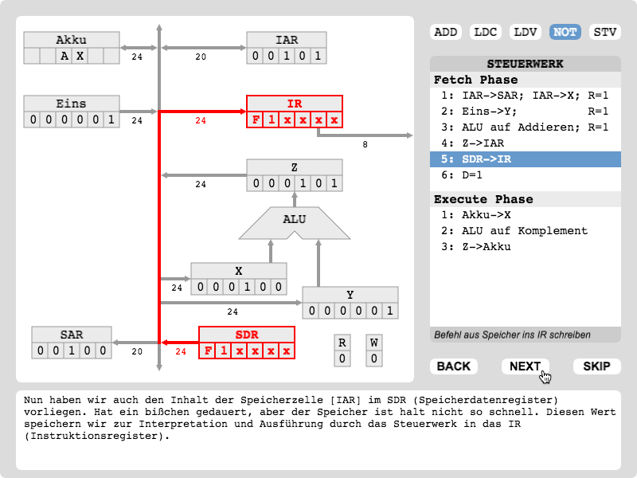

# MIMAviz

MIMAviz is a rewrite of the original [MIMA Simulation](http://ti.ira.uka.de/Visualisierungen/Mima/) in Javascript using [Pixi.js](https://github.com/pixijs/pixi.js). The original visualization app was a Java Applet which doesn't work in most modern browsers any more.

You may visit the hosted [latest version](https://hexrcs.github.io/MIMAviz/) and give it a spin right now!

## Features

- Full functionality of the original [MIMA Simulation](http://ti.ira.uka.de/Visualisierungen/Mima/)
- A handy _BACK_ button to go back to the previous step
- Only needs a modern web browser - **No Java required**!

## Usage

Easy, visit the hosted [latest version](https://hexrcs.github.io/MIMAviz/). Choose the instruction you would like to visualize, then click _START_. Use the navigation buttons to go forward or backward. Choose another instruction if you want to see more!

### Embedding in your own website

This app is bundled, transpiled and minified with Webpack and Babel. You may find a `bundle.js` in the `/dist` folder of the project, or download the tar ball from the [Releases](https://github.com/hexrcs/MIMAviz/releases) page. After being link to your HTML, it will append a 800x600 canvas to an existing DOM element with ID `mimaviz`. You may then use CSS to customize either the parent element or the canvas itself.

If you wish to customize this behaviour, you may modify the `/src/js/app.js` file found in the project, then recompile the project.

## Motivation

To help my fellow students at KIT like me, who are interested in seeing the MIMA simulation/visualization but don't have a legacy browser installed which still supports Java applets. Also to practice my newbie JS skills as well as to try building a more serious app for the first time, from GUI sketching to publishing. ;)

## Known Issues

Although Pixi.js allows pretty good backward compatibility, this app runs best on latest web browsers. In my testings, the app will not run properly in Internet Explorer 11 (not tested on Edge). The font also looks a bit weird in Windows with both Firefox and Chrome. However, if you are on a Linux or macOS machine, you shouldn't notice an issue.

## This project also borrows...

... the original detailed and friendly German descriptions, presented in the original [MIMA Simulation](http://ti.ira.uka.de/Visualisierungen/Mima/) (authored by Thorsten Rapp and supervised by Tamim Asfour). I have made minor adjustments to fit them in the new context of the app.

## Check out these other awesome projects!

- _[MIMA Toolchain](https://github.com/cbdevnet/mima) by [cbdev](https://github.com/cbdevnet)_ - This is the project which first inspired me to learn more about MIMA
- _[mimaFPGA](https://github.com/mkiesinger/mimaFPGA) by [Manuel Killinger](https://github.com/mkiesinger)_ - A VHDL implementation of MIMA
- _[BitFriendly](https://github.com/hexrcs/BitFriendly) by [me](https://github.com/hexrcs)_ - Shameless self promotion. ;) A tiny library which helps doing bitwise stuff in JS, meant to be utilized by my other MIMA compiler/interpreter project (which is still under development)
- _[phiresky/mima](https://github.com/phiresky/mima) by [phiresky](https://github.com/phiresky)_ - I didn't realize that there's already a super cool MIMA compiler/interpreter project written in Javascript until recently. It looks awesome and can transpile your MIMA programs to C
- _[MiMaSimu](https://github.com/Indidev/MiMaSimu) by [Indidev](https://github.com/Indidev)_ - A MIMA simulator written in Java, but with GUI and visualization!
- _[timhabermaas/Mima](https://github.com/timhabermaas/Mima) by [Tim Habermaas](https://github.com/timhabermaas)_ - A MIMA simulator written in Ruby

## License

MIMAviz is distributed under the MIT License. For more information, read the file [LICENSE](LICENSE).
